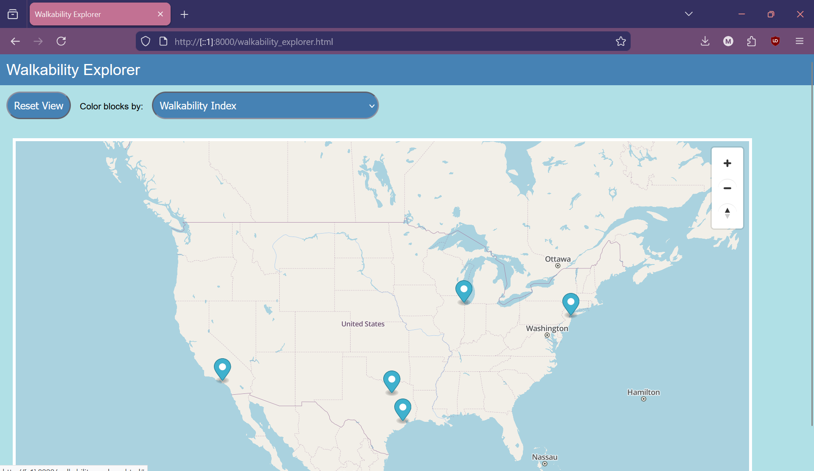

# Walkability Explorer

Maggie Larson

## Goal

My goal, as outlined in the proposal, is to create an interactive way to explore the component variables used to calculate the EPA National Walkability Index. The main variables are street intersection density, employment and household entropy, employment only entropy and proximity to transit. 

## Data Challenges

The main data challenge is the number of small blocks in the entire dataset; it was a little challenging to find the right approach to ensure both reasonable performance and effective visualization. To handle the data challenges, I've restricted the explorer to the same few cities I included for the static visualization, so that only the data for each of five CBSAs is loaded. It would be preferable to have coverage over the entire country, but I was having trouble loading the entire geojson file. The other challenge is the visualization - when zoomed out, city blocks are too small to see, so I've limited how far the user can zoom out. Another possible approach which I might try is implementing county-level aggregated data at higher zooms.

## Walk Through

<video controls src="20251130-0002-58.1531980.mp4" title="Title"></video>

The initial map shows markers for each available city; you can then click on a city to zoom in and explore block group level walkability and the component variables used to calculate the walkability score. 

## Questions

1. Do you think it would be worthwhile to add additional features, or should I continue to refine the current visualization? I think for example it might be nice to show some additional charts/stats for each city.